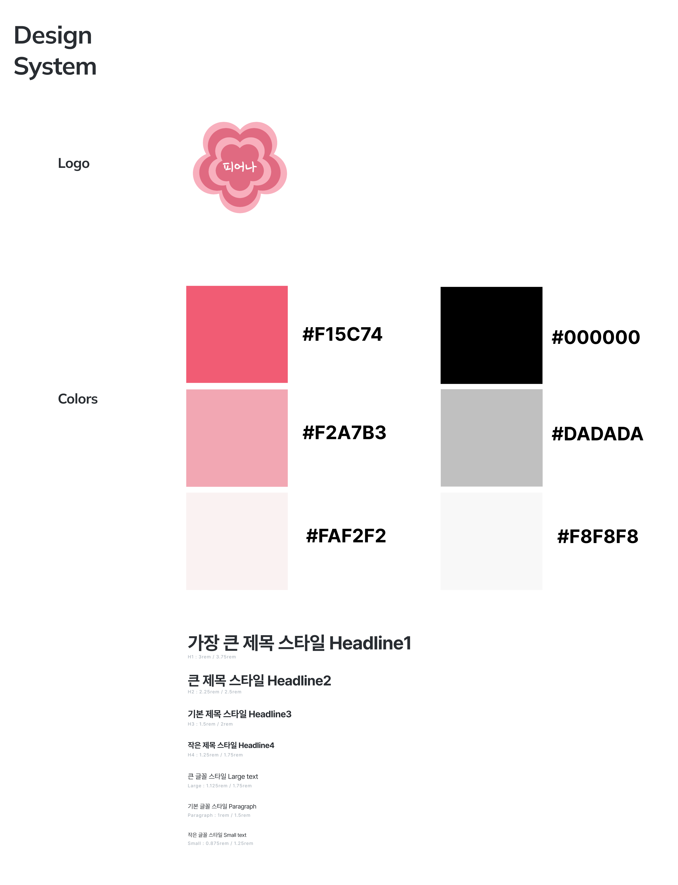
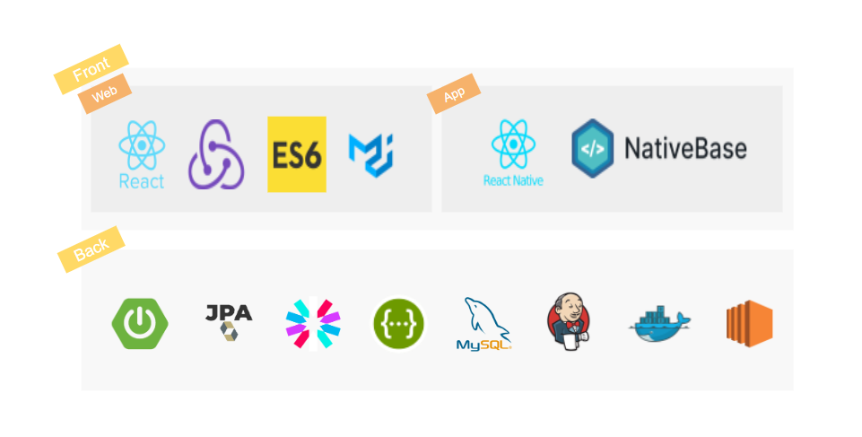
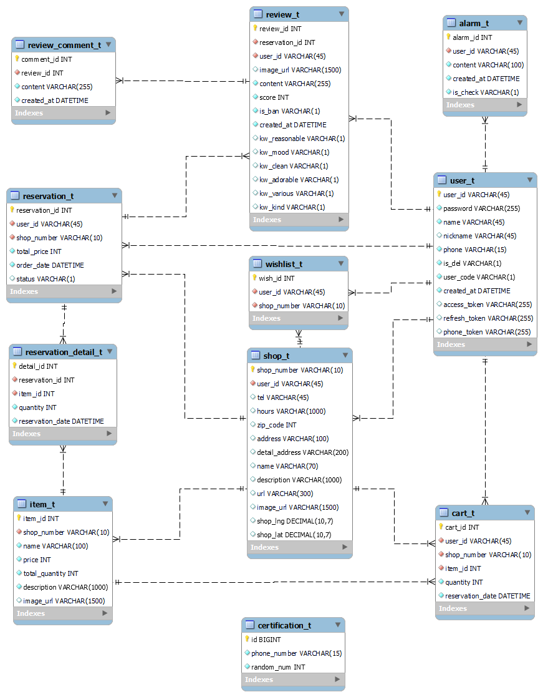
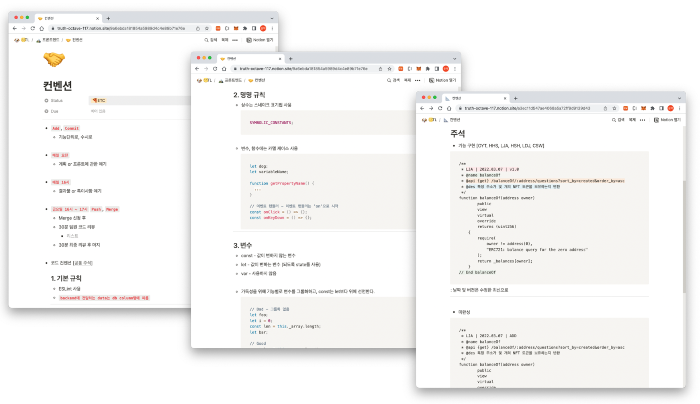

# 🌸 피어나 [피크닉 어디서 빌리나?]
[[_TOC_]]

## 1. 피어나 소개

- 개발 기간 : 2022년 4월 11일 [월] ~ 2022년 5월 20일 [금]
- 주제 : 앱 기반 피크닉 물품 대여 중개 플랫폼 서비스
- 팀명 : 👖 청바지! (**청**춘은 **바**로 **지**금)

## 2. 개요

🌸 **피크닉** 물품 대여 중개 플랫폼, **피어나!**

> 피크닉 세트 대여 서비스가 늘어나고 있지만, 이를 한 눈에 볼 수 있는 플랫폼이 없어 검색 및 예약에 불편함이 있습니다. 따라서 **소비자**에게는 검색과 서비스 이용에 편의를 주고, **기업**에는 대여 서비스 활성화를 통해 매출 증진에 도움을 주는 **피크닉 물품 대여 중개 플랫폼 서비스**인 피어나를 준비했습니다.
> 
> 1. 소비자가 피크닉 세트를 대여하기 위해서 일일이 검색하지 않고 **피어나**를 사용하여 일괄적으로 비교하여 선택할 수 있도록 정보를 제공합니다.
> 
> 2. 대여 서비스를 이용함으로써 **소비자**는 자연스레 환경보호에 동참하고, 일회용품 사용을 줄일 수 있습니다.
> 
>  **피어나**를 통해 기업과 고객은 **일회용품 사용에 대한 문제점 인식과 개선**을 이루고, 도움을 줄 수 있기를 기대합니다.
>

#### 🎨디자인 컨셉

## 3. 기술스택

## 4. 주기능 소개

#### 고객 - 검색(키워드 검색, 지역 및 지하철역 검색)

#### 고객 - 검색 결과(리스트, 지도)

#### 고객 - 예약 및 결제

#### 업체 - 예약관리

#### 관리자 - 회원 관리

## 5. ERD

## 6. 형상관리

## 7. 설치 및 배포 방법

[`설치 및 배포 메뉴얼`](exec/%EB%B9%8C%EB%93%9C%20%EB%B0%8F%20%EB%B0%B0%ED%8F%AC.pdf)

## 8. 프로젝트 파일 구조

- Front end
  - [`App`](outputs/FileTree/App_Front_End.md)
  - [`Web`](outputs/FileTree/Web_Front_End.md)
- Back end
  - [`App`](outputs/FileTree/App_Back_End.md)
  - [`Web`](outputs/FileTree/Web_Back_End.md)

## 9. Contributors

- [`Lee Junga`](https://github.com/wjddk7507)
- [`O YunTaek`](https://github.com/xordbs)
- [`Han Hyesung`](https://github.com/Hyesung-Han)
- [`Lee Dongjune`](https://github.com/Dorororodong)
- [`Lee Hojin`](https://github.com/roycmlhj)
- [`Choi Sowon`](https://github.com/sowonlevelup)
